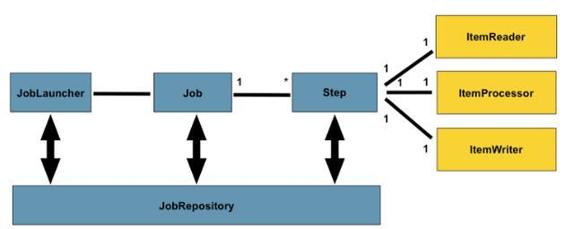
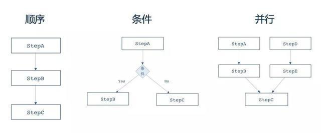
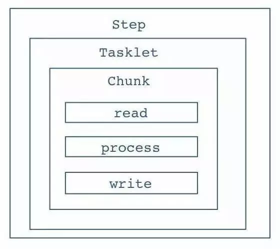

官网 https://docs.spring.io/spring-batch/docs/4.3.x/reference/html/index.html

## 一文吃透spring batch批量处理框架

https://www.cnblogs.com/miantiao312/p/9788002.html

#### 批处理特点

- 批量执行：能够处理大批量数据的导入、导出和业务逻辑计算。

- 自动执行：无需人工干预，能够自动化执行批量任务。

- 健壮性：不会因为无效数据或错误数据导致程序崩溃。

- 可靠性：通过跟踪、监控、日志及相关的处理策略（重试、跳过、重启）实现批作业的可靠执行。

- 扩展性：通过并发或者并行技术实现应用的纵向和横向扩展，满足海量数据处理的性能需求。

#### 一个典型的批处理作业

```xml
<!-- 账单作业 -->
<job id="billJob">
    <step id="billStep">
        <tasklet transaction-manager="transactionManager">
            <chunk reader="csvItemReader" writer="csvItemWriter"
                   processor="creditBillProcessor" commit-interval="2">
            </chunk>
        </tasklet>>
    </step>
</job>
```

典型的一个作业分为3部分：作业读、作业处理、作业写，也是典型的三步式架构。整个批处理框架基本上围绕Read、Process、Writer来处理。

除此之外，框架提供了作业调度器、作业仓库（用以存放Job的元数据信息，支持内存、DB两种模式）。完整的领域概念模型参加下图：



框架在Job层面，同样提供了作业编排的概念，包括顺序、条件、并行作业编排。



#### 批处理框架的不足与增强

Spring Batch批处理框架虽然提供了4种不同的监控方式，但从目前的使用情况来看，都不是非常的友好。

1. 通过DB直接查看：对于管理人员来讲，真的不忍直视；

1. 通过API实现自定义的查询：这是程序员的天堂，确实运维人员的地狱；

1. 提供了Web控制台：目前提供的功能太裸露，无法直接用于生产；

1. 提供JMX查询方式：对于非开发人员太不友好。

##### 什么是JMX？

所谓JMX，是Java Management Extensions(Java管理扩展)的缩写，是一个为应用程序植入管理功能的框架。用户可以在任何Java应用程序中使用这些代理和服务实现管理。https://www.jianshu.com/p/8c5133cab858

## SpringBoot - Spring Batch批处理使用样例

https://www.hangge.com/blog/cache/detail_2701.html

读取文件数据并导入到数据库中。

## 记一次Spring Batch完整入门实践

https://www.jianshu.com/p/9c31a2a377e0

本文将从0到1讲解一个Spring Batch是如何搭建并运行起来的，讲解从一个文本文件读取数据，然后写入MySQL。

### Spring Batch 结构

- Spring Batch运行的基本单位是一个Job，一个Job就做一件批处理的事情。

- 一个Job包含很多Step，step就是每个job要执行的单个步骤。

- Step里面，会有Tasklet，Tasklet是一个任务单元，它是属于可以重复利用的东西。

- 然后是Chunk，chunk就是数据块，你需要定义多大的数据量是一个chunk。

- Chunk里面就是不断循环的一个流程，读数据，处理数据，然后写数据。Spring Batch会不断的循环这个流程，直到批处理数据完成。



# 学习例子

## Spring Boot下Spring Batch入门实例【可用】

https://www.jianshu.com/p/305192ea4cb1

这是一个简单的例子，通过java config方式配置，处理3个数字串，不需要数据库支持。最简单的一个例子。

## 如何运行多个job

https://blog.csdn.net/u013174217/article/details/64906572

正常途径，只能运行一个job。


# 《Spring Batch 批处理框架》

## 第1篇 入门篇

### 第1章 Spring Batch简介

1.1 什么是批处理 2
1.2 Spring Batch 3
1.2.1 典型场景 3
1.2.2 Spring Batch架构 4
1.3 Spring Batch优势 4
1.3.1 丰富的开箱即用组件 5
1.3.2 面向Chunk的处理 5
1.3.3 事务管理能力 5
1.3.4 元数据管理 5
1.3.5 易监控的批处理应用 5
1.3.6 丰富的流程定义 5
1.3.7 健壮的批处理应用 6
1.3.8 易扩展的批处理应用 6
1.3.9 复用企业现有IT资产 6
1.4 Spring Batch 2.0新特性 6
1.4.1 支持Java5 7
1.4.2 支持非顺序的Step 7
1.4.3 面向Chunk处理 7
1.4.4 元数据访问 11
1.4.5 扩展性 11
1.4.6 可配置性 12
1.5 Spring Batch 2.2新特性 13
1.5.1 Spring Data集成 13
1.5.2 支持Java配置 13
1.5.3 Spring Retry 14
1.5.4 Job Parameters 14
1.6 开发环境搭建 15

### 第2章 Spring Batch之Hello World

2.1 场景说明 16
2.2 项目准备 16
2.2.1 项目结构 16
2.2.2 准备对账单文件 17
2.2.3 定义领域对象 18
2.3 定义job基础设施 18
2.4 定义对账Job 19
2.4.1 配置ItemReader 19
2.4.2 配置ItemProcessor 21
2.4.3 配置ItemWriter 22
2.5 执行Job 23
2.5.1 Java调用 23
2.5.2 JUnit单元测试 24
2.6 概念预览 26

## 第2篇 基本篇

### 第3章 Spring Batch基本概念

3.1 命名空间 29
3.2 Job 30
3.2.1 Job Instance 31
3.2.2 Job Parameters 33
3.2.3 Job Execution 34
3.3 Step 35
3.3.1 Step Execution 37
3.4 Execution Context 38
3.5 Job Repository 39
3.5.1 Job Repository Schema 39
3.5.2 配置Memory Job Repository 40
3.5.3 配置DB Job Repository 41
3.5.4 数据库Schema 42
3.6 Job Launcher 48
3.7 ItemReader 49
3.8 ItemProcessor 50
3.9 ItemWriter 50

### 第4章 配置作业Job

4.1 基本配置 52
4.1.1 重启Job 54
4.1.2 Job拦截器 55
4.1.3 Job Parameters校验 58
4.1.4 Job抽象与继承 59
4.2 高级特性 61
4.2.1 Step Scope 61
4.2.2 属性Late Binding 62
4.3 运行Job 63
4.3.1 调度作业 65
4.3.2 命令行执行 68
4.3.3 与定时任务集成 71
4.3.4 与Web应用集成 73
4.3.5 停止Job 77

### 第5章 配置作业步Step

5.1 配置Step 86
5.1.1 Step抽象与继承 87
5.1.2 Step执行拦截器 89
5.2 配置Tasklet 92
5.2.1 重启Step 93
5.2.2 事务 94
5.2.3 事务回滚 96
5.2.4 多线程Step 97
5.2.5 自定义Tasklet 97
5.3 配置Chunk 99
5.3.1 提交间隔 102
5.3.2 异常跳过 103
5.3.3 Step重试 105
5.3.4 Chunk完成策略 107
5.3.5 读、处理事务 110
5.4 拦截器 112
5.4.1 ChunkListener 115
5.4.2 ItemReadListener 116
5.4.3 ItemProcessListener 116
5.4.4 ItemWriteListener 117
5.4.5 SkipListener 117
5.4.6 RetryListener 118

### 第6章 读数据ItemReader

6.1 ItemReader 120
6.1.1 ItemReader 120
6.1.2 ItemStream 121
6.1.3 系统读组件 122
6.2 Flat格式文件 122
6.2.1 Flat文件格式 123
6.2.2 FlatFileItemReader 125
6.2.3 RecordSeparatorPolicy 129
6.2.4 LineMapper 130
6.2.5 DefaultLineMapper 131
6.2.6 LineCallbackHandler 138
6.2.7 读分隔符文件 139
6.2.8 读定长文件 141
6.2.9 读JSON文件 143
6.2.10 读记录跨多行文件 145
6.2.11 读混合记录文件 147
6.3 XML格式文件 150
6.3.1 XML解析 150
6.3.2 Spring OXM 151
6.3.3 StaxEventItemReader 153
6.4 读多文件 156
6.5 读数据库 159
6.5.1 JdbcCursorItemReader 160
6.5.2 HibernateCursorItemReader 167
6.5.3 StoredProcedureItemReader 171
6.5.4 JdbcPagingItemReader 174
6.5.5 HibernatePagingItemReader 179
6.5.6 JpaPagingItemReader 183
6.5.7 IbatisPagingItemReader 186
6.6 读JMS队列 190
6.6.1 JmsItemReader 190
6.7 服务复用 194
6.8 自定义ItemReader 197
6.8.1 不可重启ItemReader 197
6.8.2 可重启ItemReader 199
6.9 拦截器 202
6.9.1 拦截器接口 202
6.9.2 拦截器异常 203
6.9.3 执行顺序 204
6.9.4 Annotation 204
6.9.5 属性Merge 205

### 第7章 写数据ItemWriter

7.1 ItemWrite 207
7.1.1 ItemWriter 208
7.1.2 ItemStream 208
7.1.3 系统写组件 209
7.2 Flat格式文件 210
7.2.1 FlatFileItemWriter 210
7.2.2 LineAggregator 214
7.2.3 FieldExtractor 217
7.2.4 回调操作 219
7.3 XML格式文件 222
7.3.1 StaxEventItemWriter 222
7.3.2 回调操作 226
7.4 写多文件 230
7.4.1 MultiResourceItemWriter 230
7.4.2 扩展MultiResourceItemWriter 233
7.5 写数据库 234
7.5.1 JdbcBatchItemWriter 235
7.5.2 HibernateItemWriter 239
7.5.3 IbatisBatchItemWriter 242
7.5.4 JpaItemWriter 245
7.6 写JMS队列 248
7.6.1 JmsItemWriter 248
7.7 组合写 252
7.8 Item路由Writer 254
7.9 发送邮件 258
7.9.1 SimpleMailMessageItemWriter 258
7.10 服务复用 262
7.10.1 ItemWriterAdapter 262
7.10.2 PropertyExtractingDelegatingItemWriter 264
7.11 自定义ItemWrite 267
7.11.1 不可重启ItemWriter 267
7.11.2 可重启ItemWriter 268
7.12 拦截器 271
7.12.1 拦截器接口 271
7.12.2 拦截器异常 273
7.12.3 执行顺序 274
7.12.4 Annotation 274
7.12.5 属性Merge 275

### 第8章 处理数据ItemProcessor

8.1 ItemProcessor 277
8.1.1 ItemProcessor 277
8.1.2 系统处理组件 278
8.2 数据转换 279
8.2.1 部分数据转换 279
8.2.2 数据类型转换 281
8.3 数据过滤 282
8.3.1 数据Filter 282
8.3.2 数据过滤统计 283
8.4 数据校验 285
8.4.1 Validator 285
8.4.2 ValidatingItemProcessor 286
8.5 组合处理器 288
8.6 服务复用 291
8.6.1 ItemProcessorAdapter 291
8.7 拦截器 293
8.7.1 拦截器接口 293
8.7.2 拦截器异常 295
8.7.3 执行顺序 295
8.7.4 Annotation 296
8.7.5 属性Merge 297

## 第3篇 高级篇

### 第9章 作业流Step Flow

#### 9.1 顺序Flow

#### 9.2 条件Flow

9.2.1 next 303
9.2.2 ExitStatus VS BatchStatus 306
9.2.3 decision条件 308

#### 9.3 并行Flow

#### 9.4 外部Flow定义

9.4.1 Flow 314
9.4.2 FlowStep 317
9.4.3 JobStep 319

#### 9.5 Step数据共享

#### 9.6 终止Job

9.6.1 end 324
9.6.2 stop 326
9.6.3 fail 327

### 第10章 健壮Job

#### 10.1 跳过Skip

10.1.1 配置Skip 331
10.1.2 跳过策略SkipPolicy 333
10.1.3 跳过拦截器 335

#### 10.2 重试Retry

10.2.1 配置Retry 339
10.2.2 重试策略RetryPolicy 341
10.2.3 重试拦截器 343
10.2.4 重试模板 345

#### 10.3 重启Restart

10.3.1 重启Job 353
10.3.2 启动次数限制 355
10.3.3 重启已完成的任务 355

### 第11章 扩展Job、并行处理

#### 11.1 可扩展性

#### 11.2 多线程Step

11.2.1 配置多线程Step 359
11.2.2 线程安全性 360
11.2.3 线程安全Step 361
11.2.4 可重启的线程安全Step 363

#### 11.3 并行Step

#### 11.4 远程Step

11.4.1 远程Step框架 366
11.4.2 基于SI实现远程Step 368

#### 11.5 分区Step

11.5.1 关键接口 374
11.5.2 基本配置 376
11.5.3 文件分区 378
11.5.4 数据库分区 382
11.5.5 远程分区Step 387