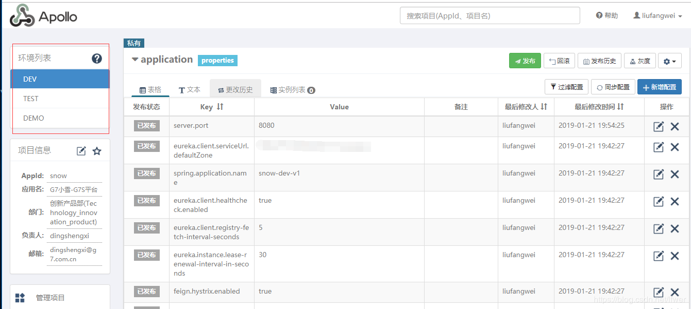

# 主流配置中心的比较 Spring Cloud Config、Apollo、Nacos

来源 https://blog.csdn.net/educast/article/details/90446604

### 为什么需要配置中心

- 配置实时生效：传统的静态配置方式要想修改某个配置只能修改之后重新发布应用，要实现动态性，可以选择使用数据库，通过定时轮询访问数据库来感知配置的变化。轮询频率低感知配置变化的延时就长，轮询频率高，感知配置变化的延时就短，但比较损耗性能，需要在实时性和性能之间做折中。配置中心专门针对这个业务场景，兼顾实时性和一致性来管理动态配置。
- 配置管理流程：配置的权限管控、灰度发布、版本管理、格式检验和安全配置等一系列的配置管理相关的特性也是配置中心不可获取的一部分。

### 开源配置中心基本介绍

- Disconf：2014年7月百度开源的配置管理中心，同样具备配置的管理能力，不过目前已经不维护了，最近的一次提交是两年前了。
- Spring Cloud Config：2014年9月开源，Spring Cloud 生态组件，可以和Spring Cloud体系无缝整合。
- Apollo：2016年5月，携程开源的配置管理中心，具备规范的权限、流程治理等特性。
- Nacos：2018年6月，阿里开源的配置中心，也可以做DNS和RPC的服务发现。

### 配置中心核心概念的对比

由于Disconf不再维护，下面对比一下Spring Cloud Config、Apollo和Nacos。

#### 应用

应用是客户端系统的基本单位，Spring Cloud Config 将应用名称和对应Git中的文件名称关联起来了，这样可以起到多个应用配置相互隔离的作用。Apollo的配置都是在某个应用下面的（除了公共配置），也起到了多个应用配置相互隔离的作用。Nacos的应用概念比较弱，只有一个用于区分配置的额外属性，不过可以使用 Group 来做应用字段，可以起到隔离作用。

#### 集群

不同的环境可以搭建不同的集群，这样可以起到物理隔离的作用，Spring Cloud Config、Apollo、Nacos都支持多个集群。

#### Label Profile & 环境 & 命名空间

Spring Cloud Config可以使用Label和Profile来做逻辑隔离，Label指远程仓库的分支，Profile类似Maven Profile可以区分环境，比如{application}-{profile}.properties。

Nacos的命名空间和Apollo的环境一样，是一个逻辑概念，可以作为环境逻辑隔离。Apollo中的命名空间指配置的名称，具体的配置项指配置文件中的一个Property。

### 功能特性对比总结

| 功能点       | Spring Cloud Config                                        | Apollo                                                       | Nacos                                                   |
| ------------ | ---------------------------------------------------------- | ------------------------------------------------------------ | ------------------------------------------------------- |
| 开源时间     | 2014.9                                                     | 2016.5                                                       | 2018.6                                                  |
| 单机读       | 7（限流所致）                                              | 9000                                                         | 15000                                                   |
| 单机写       | 5（限流所致）                                              | 1100                                                         | 1800                                                    |
| 3节点读      | 21（限流所致）                                             | 27000                                                        | 45000                                                   |
| 3节点写      | 5（限流所致）                                              | 3300                                                         | 5600                                                    |
| 配置实时推送 | 支持Spring Cloud Bus                                       | 支持HTTP长轮询1S内                                           | 支持HTTP长轮询1S内                                      |
| 配置回滚     | 支持Git                                                    | 支持                                                         | 支持                                                    |
| 灰度发布     | 支持                                                       | 支持                                                         | 待支持                                                  |
| 多集群       | 支持                                                       | 支持                                                         | 支持                                                    |
| 多环境       | 支持                                                       | 支持                                                         | 支持                                                    |
| 多语言       | 只支持Java                                                 | Go C++ Python PHP Java(原生 SDK Spring Spring Boot) .Net OpenAPI | Python Java(原生 SDK Spring Spring Boot) Nodejs OpenAPI |
| 配置格式校验 | 不支持                                                     | 支持                                                         | 支持                                                    |
| 单机部署     | Config-Server + Git + Spring Cloud Bus（支持配置实时推送） | Apollo quickstart + MySQL                                    | Nacos单节点                                             |
| 分布式部署   | Config-Server(2) + Git + MQ（部署复杂）                    | Config(2) + Admin(2) + Portal(2) + MySQL（部署复杂）         | Nacos（3）+ MySQL（部署简单）                           |
| 版本管理     | 支持Git                                                    | 支持                                                         | 支持                                                    |
| 权限管理     | 支持                                                       | 支持                                                         | 待支持                                                  |
| 监听查询     | 支持                                                       | 支持                                                         | 支持                                                    |
| 通信协议     | HTTP和AMQP                                                 | HTTP                                                         | HTTP                                                    |
| 数据一致性   | Git保证数据一致性，Config-Server从Git读数据                | 数据库模拟消息队列，Apollo定时读消息                         | HTTP异步通知                                            |

### 总的来说

Apollo和Nacos相对于Spring Cloud Config的生态支持更广，在配置管理流程上做的更好。Apollo相对于Nacos在配置管理做的更加全面，不过使用起来也要麻烦一些。Nacos使用起来相对比较简洁，在对性能要求比较高的大规模场景更适合。