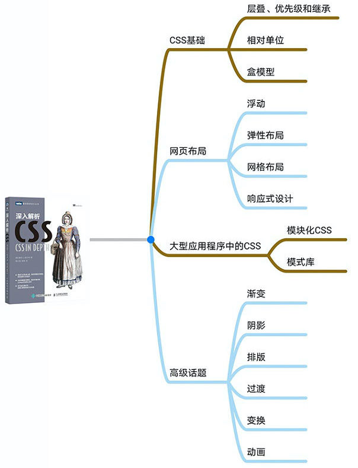

# 《深入解析CSS》

## 第一部分 基础回顾 

第1章 层叠、优先级和继承　2 
1．1 层叠　3 
1．1．1 样式表的来源　5 
1．1．2 理解优先级　8 
1．1．3 源码顺序　12 
1．1．4 两条经验法则　14 
1．2 继承　15 
1．3 特殊值　17 
1．3．1 使用inherit关键字　17 
1．3．2 使用initial关键字　18 
1．4 简写属性　19 
1．4．1 简写属性会默默覆盖其他样式　20 
1．4．2 理解简写值的顺序　20 
1．5 总结　23 
第2章 相对单位　24 
2．1 相对值的好处　24 
2．1．1 那些年追求的像素级完美　25 
2．1．2 像素级完美的时代终结了　25 
2．2 em和rem　26 
2．2．1 使用em定义字号　27 
2．2．2 使用rem设置字号　31 
2．3 停止像素思维　32 
2．3．1 设置一个合理的默认字号　33 
2．3．2 构造响应式面板　34 
2．3．3 缩放单个组件　35 
2．4 视口的相对单位　36 
2．4．1 使用vw定义字号　38 
2．4．2 使用calc()定义字号　39 
2．5 无单位的数值和行高　39 
2．6 自定义属性（即CSS变量）　41 
2．6．1 动态改变自定义属性　43 
2．6．2 使用JavaScript改变自定义属性　45 
2．6．3 探索自定义属性　46 
2．7 总结　46 
第3章 盒模型　47 
3．1 元素宽度的问题　47 
3．1．1 避免魔术数值　50 
3．1．2 调整盒模型　51 
3．1．3 全局设置border-box　52 
3．1．4 给列之间加上间隔　53 
3．2 元素高度的问题　54 
3．2．1 控制溢出行为　55 
3．2．2 百分比高度的备选方案　56 
3．2．3 使用min-height和max-height　60 
3．2．4 垂直居中内容　60 
3．3 负外边距　62 
3．4 外边距折叠　62 
3．4．1 文字折叠　63 
3．4．2 多个外边距折叠　63 
3．4．3 容器外部折叠　64 
3．5 容器内的元素间距　65 
3．5．1 如果内容改变了　67 
3．5．2 更通用的解决方案：猫头鹰选择器　68 
3．6 总结　71 

## 第二部分 精通布局 

第4章 理解浮动　74 
4．1 浮动的设计初衷　74 
4．2 容器折叠和清除浮动　80 
4．2．1 理解容器折叠　80 
4．2．2 理解清除浮动　82 
4．3 出乎意料的“浮动陷阱”　84 
4．4 媒体对象和BFC　87 
4．4．1 BFC　88 
4．4．2 使用BFC实现媒体对象布局　89 
4．5 网格系统　90 
4．5．1 理解网格系统　91 
4．5．2 构建网格系统　91 
4．5．3 添加间隔　95 
4．6 总结　99 
第5章 Flexbox　100 
5．1 Flexbox的原则　100 
5．1．1 创建一个基础的Flexbox菜单　103 
5．1．2 添加内边距和间隔　105 
5．2 弹性子元素的大小　107 
5．2．1 使用flex-basis属性　109 
5．2．2 使用flex-grow属性　109 
5．2．3 使用flex-shrink属性　110 
5．2．4 实际应用　111 
5．3 弹性方向　112 
5．3．1 改变弹性方向　114 
5．3．2 登录表单的样式　115 
5．4 对齐、间距等细节　117 
5．4．1 理解弹性容器的属性　117 
5．4．2 理解弹性子元素的属性　120 
5．4．3 使用对齐属性　121 
5．5 值得注意的地方　122 
5．5．1 Flexbugs　123 
5．5．2 整页布局　123 
5．6 总结　123 
第6章 网格布局　124 
6．1 网页布局开启新纪元　124 
6．2 网格剖析　127 
6．2．1 网格线的编号　132 
6．2．2 与Flexbox配合　133 
6．3 替代语法　137 
6．3．1 命名的网格线　137 
6．3．2 命名网格区域　139 
6．4 显式和隐式网格　140 
6．4．1 添加变化　144 
6．4．2 让网格元素填满网格轨道　146 
6．5 特性查询　149 
6．6 对齐　152 
6．7 总结　153 
第7章 定位和层叠上下文　154 
7．1 固定定位　154 
7．1．1 用固定定位创建一个模态框　155 
7．1．2 控制定位元素的大小　158 
7．2 绝对定位　158 
7．2．1 让Close按钮绝对定位　158 
7．2．2 定位伪元素　159 
7．3 相对定位　161 
7．3．1 创建一个下拉菜单　161 
7．3．2 创建一个CSS三角形　164 
7．4 层叠上下文和z-index　166 
7．4．1 理解渲染过程和层叠顺序　166 
7．4．2 用z-index控制层叠顺序　168 
7．4．3 理解层叠上下文　168 
7．5 粘滞定位　171 
7．6 总结　174 
第8章 响应式设计　175 
8．1 移动优先　176 
8．1．1 创建移动版的菜单　182 
8．1．2 给视口添加meta标签　185 
8．2 媒体查询　186 
8．2．1 媒体查询的类型　187 
8．2．2 给网页添加断点　189 
8．2．3 添加响应式的列　192 
8．3 流式布局　194 
8．3．1 给大视口添加样式　195 
8．3．2 处理表格　196 
8．4 响应式图片　198 
8．4．1 不同视口大小使用不同的图片　198 
8．4．2 使用srcset提供对应的图片　199 
8．5 总结　200 

## 第三部分 大型应用中的CSS 

第9章 模块化CSS　202 
9．1 基础样式：打好基础　203 
9．2 一个简单的模块　204 
9．2．1 模块的变体　205 
9．2．2 多元素模块　208 
9．3 把模块组合成更大的结构　211 
9．3．1 拆分不同模块的职责　212 
9．3．2 模块命名　215 
9．4 工具类　 217 
9．5 CSS方法论　217 
9．6 总结　219 
第10章 模式库　220 
10．1 KSS简介　221 
10．1．1 配置KSS　222 
10．1．2 编写KSS文档　223 
10．1．3 记录模块变体　227 
10．1．4 创建概览页面　229 
10．1．5 记录需要JavaScript的模块　229 
10．1．6 为模式库分组　232 
10．2 改变编写CSS的方式　234 
10．2．1 CSS优先的工作流程　234 
10．2．2 像API一样使用模式库　235 
10．3 总结　240 

## 第四部分 高级话题 

第11章 背景、阴影和混合模式　242 
11．1 渐变　243 
11．1．1 使用多个颜色节点　245 
11．1．2 使用径向渐变　247 
11．2 阴影　248 
11．2．1 使用渐变和阴影形成立体感　249 
11．2．2 使用扁平化设计创建元素　251 
11．2．3 让按钮看起来更时尚　252 
11．3 混合模式　253 
11．3．1 为图片着色　255 
11．3．2 理解混合模式的类型　256 
11．3．3 为图片添加纹理　257 
11．3．4 使用融合混合模式　258 
11．4 总结　260 
第12章 对比、颜色和间距　261 
12．1 对比最重要　262 
12．1．1 建立模式　263 
12．1．2 还原设计稿　264 
12．2 颜色　266 
12．2．1 理解颜色表示法　272 
12．2．2 添加新颜色到调色板　275 
12．2．3 思考字体颜色的对比效果　277 
12．3 间距　279 
12．3．1 使用em还是px　279 
12．3．2 思考一下行高　281 
12．3．3 为行内元素设置间距　284 
12．4 总结　286 
第13章 排版　287 
13．1 Web字体　288 
13．2 谷歌字体　289 
13．3 如何使用@font-face　293 
13．3．1 字体格式与回退处理　294 
13．3．2 同一种字型的多种变体　295 
13．4 调整字距，提升可读性　296 
13．4．1 正文主体的字间距　297 
13．4．2 标题、小元素和间距　298 
13．5 恼人的FOUT和FOIT　302 
13．5．1 使用Font Face Observer　304 
13．5．2 回退到系统字体　305 
13．5．3 准备使用font-display　307 
13．6 总结　308 
第14章 过渡　309 
14．1 从这边到那边　309 
14．2 定时函数　311 
14．2．1 理解贝塞尔曲线　312 
14．2．2 阶跃　315 
14．3 非动画属性　316 
14．3．1 不可添加动画效果的属性　318 
14．3．2 淡入与淡出　319 
14．4 过渡到自动高度　321 
14．5 总结　323 
第15章 变换　324 
15．1 旋转、平移、缩放和倾斜　324 
15．1．1 更改变换基点　327 
15．1．2 使用多重变换　327 
15．2 在运动中变换　328 
15．2．1 放大图标　333 
15．2．2 创建“飞入”的标签　335 
15．2．3 交错显示过渡　337 
15．3 动画性能　338 
15．4 三维（3D）变换　340 
15．4．1 控制透视距离　341 
15．4．2 实现高级3D变换　343 
15．5 总结　346 
第16章 动画　347 
16．1 关键帧　348 
16．2 为3D变换添加动画　350 
16．2．1 创建无动画页面布局　350 
16．2．2 为布局添加动画　355 
16．3 动画延迟和填充模式　356 
16．4 通过动画传递意图　359 
16．4．1 反馈用户操作　359 
16．4．2 吸引用户的注意力　362 
16．5 最后一点建议　365 
16．6 总结　365 
附录A 选择器　366 
附录B 预处理器　370