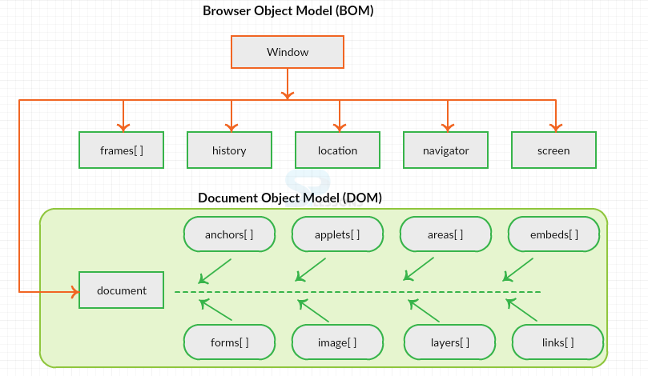

# 《JavaScript高级程序设计》笔记

## 第1章 JavaScript简介

### 小结

JavaScript是一种专为与网页交互而设计的脚本语言，由下列三个不同的部分组成：

- ECMAScript，提供核心语言功能；
- 文档对象模型（DOM），提供访问和操作网页内容的方法和接口；
- 浏览器对象模型（BOM），提供与浏览器交互的方法和接口。

## 第2章 在HTML中使用JavaScript

### `<script>`元素

HTML 5为`<script>`定义了下列6个属性：

1. async（可选）
2. charset（可选）
3. defer（可选）
4. language（已废弃）
5. src（可选）
6. type（必选）

在使用`<script>`嵌入JavaScript代码时，记住不要在代码中的任何地方出现“</script>”这符串。

```js
<script type="text/javascript">
    function sayScript() {
        alert("</script>"); //alert("<\/script>")
    }
</script>
```

带有src属性的`<script>`元素不应该在其`<script>`和`</script>`标签之间再包含额外的JavaScript代码。如果包含了嵌入的代码，则只会下载并执行外部脚本文件，嵌入的代码会被忽略。

通过`<script>`元素的src属性还可以包含来自外部域的JavaScript文件，与``元素非常相似。这一点即让它倍显强大，又让它备受争议。

无论如何包含代码，只要不存在defer和async属性，浏览器都会按照`<script>`元素在页面中出现的先后顺序对它们依次进行解析。换句话说，在第一个`<script>`元素包含的代码解析完成后，第二个`<script>`包含的代码才会被解析，然后才是第三个、第四个……

### 延迟脚本（defer）

立即下载，但延迟执行。

### 异步脚本（async）

立即下载，不保证执行顺序。

### 小结

- 所有`<script>`元素都会按照它们在页面中出现的先后顺序依次被解析。
- 使用`<noscript>`元素可以指定在不支持脚本的浏览器中显示的替代内容。

## 第3章 基本概念

ECMAScript3.1最终改名为ECMAScript5。

### 语法

- `typeOf`可以是一个有效的函数名。`typeof`是一个操作符而不是函数。
- 严格模式可以用在：整个脚本、函数体内。
- 为什么语句要加尾部分号？2个理由。
- 一般而言，不存在需要显式地把一个变量设置为`undefined`值的情况。`undefined`值是派生自`null`值的。`undefined == true` ?

### 关键字和保留字

- 使用保留字作标识符可能会也可能不会导致错误，具体取决于特定的引擎。
- 严格模式下实测关键字、保留了、`eval`和`arguments`可以作为对象的属性，为什么？

### 变量

- 未经过初始化的变量，会保存一个特殊的值——`undefined`。
- 在函数中使用`var`定义一个变量，那么这个变量在函数退出后就会被销毁。
- 使用一条语句定义多个变量。

### 数据类型

- 5种基本数据数据类型，外加Object，所有值都将是上述6种数据类型之一。Object、Array、function是引用类型。String比较特殊。
- typeof是一个操作符而不是函数。
- undefined和null数据类型，都只有一个值。

- 函数在ECMAScript中是对象，不是一种数据类型。

- 对于尚未声明过的变量，只能执行一项操作，即使用typeof操作符检测其数据类型。然而，令人困惑的是：对未初始化的变量执行typeof操作符会返回undefined值，而对未声明的变量执行typeof操作符同样也会返回undefined值。

- Boolean类型的字面值true和false是区分大小写的。ECMAScript中所有类型的值都有与这两个Boolean值等价的值。

- Boolean()、Number()、parseInt()、parseFloat()、isNaN()的使用和区别？

- parseInt()的基数介于2-36之间，0为十进制，1返回NaN，数字大于基数也返回NaN。为了避免错误的解析，建议无论在什么情况下都明确指定基数。parseFloat()只解析十进制，它没有第二个参数，只要有可能它也会返回整数。

- `isNaN()`用于对象时，选调用对象的`valueOf()`，再调用对象的`toString()`。

- Number.MIN_VALUE、Number.MAX_VALUE、-Infinity、Infinity、isFinite()。

- NaN是一个特殊的数值，不要认为它是与undefined、null类似的数据类型。

- 用双引号表示的字符串和用单引号表示的字符串完全相同。

- ECMAScript中的字符串是不可变的，也就是说，字符串一旦创建，它们的值就不能改变。

  ```js
  var lang = "Java";
  lang = lang + "Script"
  ```

  实现这个操作的过程如下：首先创建一个能容纳10个字符串的新字符串，然后在这个字符串中填充“Java”和“Script”，最后一步是销毁原来的字符串“Java”和字符串“Script”。

- 要把一个值转换为一个字符串有两种方式：几乎每个值都有的`toString()`方法（`null`和`undefined`没有）、转型函数`String()`。`String()`函数遵循下列转换规则：

  - 如果值有`toString()`方法，则调用该方法（没有参数）并返回相应的结果；
  - 如果值是`null`，则返回`"null"`；
  - 如果值是`undefined`，则返回`"undefined"`。

- 在调用数值的`toString()`方法时，可以传递一个参数：输出数值的基数。

- Object的每个实例都具有下列属性和方法：

  - constructor
  - hasOwnProperty(propertyName)
  - isPrototypeOf(Object)
  - propertyIsEnumerable(propertyName)
  - toLocaleString()
  - toString()
  - valueOf()

### 操作符

- 在应用于不同的值时，递增和递减操作符遵循下列规则：

  - 在应用于一个包含有效数字字符的字符串时，先将其转换为数字值，再执行加减1的操作。
  - 在应用于一个不包含有效数字字符串时，将变量的值设置为NaN。
  - 布尔值`false`，先将其转换为0再执行加减1操作。
  - 布尔值`true`，先将其转换为1再执行加减1操作。
  - 在应用于浮点数值时，执行加减1操作。
  - 在应用于对象时，先调用对象的`valueOf()`方法以取得一个可供操作的值。然后对该值应用前述规则。如果结果是NaN，则在调用`toString()`方法后再应用前述规则。

- 在对非数值应用一元加操作符时，该操作符会像`Number()`转型函数一样对这个值执行转换。换句话说，布尔值false和true将被转换为0和1，字符串值会被按照一组特殊的规则进行解析，而对象是先调用它们的`valueOf()`和（或）`toString()`方法，再转换得到的值。

- 同时使用两个逻辑非操作符，实际上就会模拟`Boolean()`转型函数的行为。

  ```javascript
  console.log(!!'blue'); //true
  console.log(!!0);      //false
  console.log(!!NaN);    //false
  console.log(!!'');     //false
  console.log(!!12345);  //true
  ```

- 逻辑与和逻辑或都是“短路操作符”。

  ```javascript
  var found = true;
  var result = (found && someUndefinedVariable);  //这里会发生错误
  alert(result);                                  //这一行不会执行
  ```

- 特别注意的是，在有一个操作数不是布尔值的情况下，表达式不一定返回布尔值。以逻辑与举例，它遵循下列规则：

  - 如果第一个操作数是对象，则返回第二个操作数；
  - 如果第一个操作数是`null`，则返回`null`；
  - 如果第一个操作数是`NaN`，则返回`NaN`；
  - 如果第一个操作数是`undefined`，则返回`undefined`。

- ECMAScript定义了3个乘性操作符：乘法、除法和求模。如果参与乘性计算的某个操作数不是数值，后台会先使用`Number()`转型函数将其转换为数值。

- 加性操作符，如果有一个操作数是字符串，那么就要应用如下规则：

  - 如果两个操作数都是字符串，则将第二个操作数与第一个操作数拼接起来；
  - 如果只有一个操作数是字符串，则将另一个操作数转换为字符串，然后再将两个字符串拼接起来。
  - 如果有一个操作数是对象、数值或布尔值，则调用它们的`toString()`方法取得相应的字符串值，然后再应用前面关于字符串的规则。对于`undefined`和`null`，则分别调用String()函数并取得字符串`"undefined"`和`"null"`。

- 关系操作符。相待和不相等，先转换再比较，全等和不全等，仅比较而不转换。

  ```js
  var result = '23' < '3';   //true
  var result = '23' < 3;     //false
  var result = 'a' < 3;      //false
  var result = NaN < 3;      //false
  
  alert(null == undefined);  //true
  alert(null === undefined); //false 它们是不同类型的值
  ```

### 语句

- ECMAScript对象的属性没有顺序。因此，通过`for-in`循环输出的属性名的顺序是不可预测的。具体来讲，所有属性都会被返回一次，但返回的先后次序可能会因浏览器而异。
- with语句的作用是将代码的作用域设置到一个特定的对象中。由于大量使用with语句会导致性能下降，同时也会给调试代码造成困难，因此在开发大型应用程序时，不建议使用with语句。
- switch语句的特色：
  - 可以使用任何数据类型；
  - 比较值时使用的是全等操作符，因此不会发生类型转换；
  - case值不一定是常量，可以是变量，甚至是表达式。

### 函数

- arguments对象只是与数组类似（它并不是Array的实例）。

- 命名的参数只提供便利，但不是必要的。解析器不会验证命名参数。

  ```js
  function howManyArgs() {
    alert(arguments.length);
  }
  
  howManyArgs('strig', 45);  //2
  howManyArgs();             //0
  howManyArgs(12);           //1
  ```

- 命名参数与arguments的内存空间是独立的，但它们的值会同步。

- 没有传递值的命名参数将自动被赋予undefined值。

- 未指定返回值的函数返回的是一个特殊的undefined值。

- 由于不存在函数签名的特性，ECMAScript函数不能重载。通过检查传入函数中参数的类型和数量并作出不同的反应，可以模仿方法的重载。

## 第4章 变量、作用域和内存问题

### 基本类型和引用类型的值

- 我们不能给基本类型的值添加属性，尽管这样做不会导致任何错误。

- 除了保存的方式不同之外，在从一个变量向另一个变量复制基本类型值和引用类型值时，也存在不同。
- 检测基本数据类型用`typeof`，检测引用类型用`instanceof`。
- 使用`instanceof`检测基本类型，始终会返回`false`，因为基本类型不是对象。

### 执行环境及作用域

- 在Web浏览器中，全局执行环境被认为是window对象。
- 每个函数都有自己的执行环境。
- 作用域链的的用途，是保证对执行环境有权访问的所有变量和函数的有序访问。
- 作用域链的前端，始终都是当前执行的代码所在的环境的变量对象。
- 全局执行环境的变量对象始终都是作用域链中的最后一个对象。
- 下面两个语句都会在作用域链的前端添加一个变量对象：
  - Try-catch语句的catch块；
  - with语句。
- 使用var声明的变量会自动被添加到最接近的环境中。

### 垃圾收集

- 方法：标记清除、引用计数。
- 在编写JavaScript程序时，开发人员不用再关心内存使用问题，所需内存的分配以及无用内存的回收完全实现了自动管理。这种垃圾收集机制的原理其实很简单：找出那些不再继续使用的变量，然后释放其占用的内存。为此，垃圾收集器会按照固定的时间间隔（或代码执行中预定的收集时间），周期性地执行这一操作。
- 到2008年为止，IE、Firefox、Opera、Chrome和Safari的JavaScript实现使用的都是标记清除式的垃圾收集策略（或类似的策略），只不过垃圾收集的时间间隔互有不同。
- Netscape Navigator 3.0是最早使用引用计数策略的浏览器，但很快它就遇到了一个严重的问题：循环引用。为此，Netscape在Navigator4.0中放弃了引用计数方式，转而采用标记清除来实现其垃圾收集机制。
- 手工解除引用：`globalPerson = null;`
- 解除一个值的引用并意味着自动回收该值所占用的内存。解除引用的真正作用是让值脱离执行环境，以便垃圾收集器下次运行时将其回收。

## 第5章

### Object

- 创建Object实例的方式有两种：

  - 使用new操作符后跟Object构造函数；
  - 使用对象字面量表示法。

  ```js
  var Person = {
    'name': 'Nicholas',
    'age': 29,
    5: true   //数值属性名会自动转换为字符串
  }
  ```

- 一般来说，访问对象的属性时使用的都是点表示法，也可以使用方括号表示法来访问对象的属性，它的主要优点是可以通过变量来访问属性。

### Array

- 数组的每一项可以保存任何类型的数据。

- 创建数组的方式有两种：

  - 使用Array构造函数；
  - 使用数组字面量表示。

  ```js
  var colors = Array(3);  //new操作符可以省略
  var values = [1,2,];    //不要这样！会创建一个包含2或3项的数组。
  ```

- 数组的length属性很有特点——它不是只读的。因此，通过设置这个属性，可以从数组的末尾移除或向数组中添加新项。

- 检测数组。如果网页中包含多个框架，`instanceof`无法识别，这时要用`Array.isArray()`方法。

- 转换方法：toLocaleString()、toString()、valueOf()。

- 重排序方法：reverse()、sort()。

- sort()方法会调用每个数组项的toString()转型方法，然后比较，即使数组中的每一项都是数值，sort()方法比较的也是字符串。sort()方法可以接收一个比较函数作为参数，以便我们指定哪个值位于哪个的前面。

  ```js
  var arr = [1, 2, 12, 3];
  
  arr.sort(function (a, b) {
      if (a < b) {
          return -1;       //a应该在b之前，返回一个负数。
      } else if (a > b) {
          return 1;        //a应该在b之后，返回一个正数。
      } else {
          return 0;        //两个数相等，返回0。
      }
  });
  ```

- 操作方法：slice()、splice()。如果slice()方法的参数中有一个负数，则用数组长度加上该数来确定相应的位置。如果结束位置小于起始位置，则返回空数组。

- 位置方法：indexOf()、lastIndexOf()。这两个方法，使用全等操作符查找。

- 迭代方法：every()、some()、filter()、map()、forEach()。每个方法接收2个参数，传入这些方法中的函数接收3个参数。

- 归并方法：reduce()、reduceRight()。每个方法接收2个参数，传入这些方法中的函数接收4个参数。

### Date


### RegExp


### Function

- 说起来ECMAScript中什么最有意思，我想莫过于函数了——而有意思的根源，则在于函数实际上是对象。每个函数都是Function类型的实例，而且都与其他引用类型一样具有属性和方法。

  ```js
  //函数声明
  function sum (num1, num2) {
    return num1 + num2;
  }
  
  //函数表达式1
  var sum = function (num1, num2) {
    return num1 + num2;
  }
  
  //函数表达式2
  var sum = new Function('num1', 'num2', 'return num1 + num2'); //不推荐
  ```

- 使用不带圆括号的函数名是访问函数指针，而非调用函数。

- 解析器会率先读取函数声明，并使其在执行任何代码之前可用（可以访问）；至于函数表达式，则必须等到解析器执行到它所在的代码行，才会真正被解释执行。即使声明函数的代码在调用它的代码后面，JavaScript引擎也能把函数声明提升到顶部。除了什么时候可以通过变量访问函数这一点区别外，函数声明与函数表达式的语法其实是等价的。

### 基本包装类型


### 单体内置对象


## 第6章 面向对象的程度设计

### 理解对象

- 创建新对象的两种模式：
  - new Object()，早期使用得多。
  - 对象字面量，现在的首选方式。
- ECMAScript中有两种属性：数据属性和访问器属性。
- 数据属性：
  - [[Configurable]]
  - [[Enumerable]]
  - [[Writable]]
  - [[Value]]
- 要修改属性的默认特性，使用Object.defineProperty()、Object.defineProperties()方法。
- 使用Object.getOwnPropertyDescriptor()方法，可以取得给定属性的描述符，这个方法接收2个参数。
- 在调用Object.defineProperty()方法创建一个新属性时，如果不指定，configurable、enumerable和writable特性的默认值都是false。
- 访问器属性：
  - [[Configurable]]
  - [[Enumerable]]
  - [[Get]]
  - [[Set]]
- `_year`前面的下划线是一种常用的记号，用于表示只能通过对象方法访问的属性。
- 使用访问器属性的常见方式，即设置一个属性的值会导致其他属性发生变化。

### 创建对象

使用Object构造函数和对象字面量都可以用来创建单个对象，但这些方法有个明显的缺点：使用同一个接口创建很多对象，会产生大量的重复代码。

- 工厂模式：没有重复代码了，但无法识别对象。
- 构造函数模式：可以识别对象了，但每个方法都要在每个实例上重新创建一遍。
- 原型模式：属性由构造函数设置，方法通过原型共享。
- 动态原型模式：把原型放到构造函数中。
- 寄生构造函数模式：返回一个对象，因此这种方式创建的对象不能依赖`instanceof`来确定对象类型。
- 稳妥构造函数模式：没有公共属性，其方法不引用`this`，不使用`new`操作符调用构造函数。

### 继承

继承是OO语言中的一个最为人津津乐道的概念。许多OO语言都支持两种继承方式：接口继承和实现继承。接口继承只继承方法签名，而实现继承则继承实际的方法。由于JavaScript函数没有签名，在ECMAScript中无法实现接口继承。ECMScript只支持实现继承，而且其实现继承主要是依靠原型链来实现的。

- 原型链：实例与原型共享属性。
- 借用构造函数：原型中的方法，对子类型而言是不可见的。
- 组合继承：最常用的继承模式。
- 原型式继承
- 寄生式继承
- 寄生组合式继承：最理想的继承范式。

## 第7章 函数表达式

```js
//不要这样做！函数声明提升，JavaScript引擎会尝试修正错误，大多数浏览器会返回第2个声明。
if (condition) {
    function sayHi() {
        alert('Hi!');
    }
} else {
    function sayHi() {
        alert('Yo!');
    }
}
```

### 递归

使用命名函数，函数名不必在多处保持一致，简便递归的使用。

```js
var factorial = (function f(num) {
    if (num <= 1) {
        return 1;
    } else {
        return num * f(num - 1);
    }
});
```

### 闭包

- 闭包可以模仿块级作用域和创建私有变量。

### 模仿块级作用域

```js
(function(){
  //这里是块级作用域
})()
```

### 私有变量

- 在一个函数内创建一个闭包，那么闭包通过自己的作用域链也可以访问这些变量。而利用这一点，就可以创建用于访问私有变量的公有方法。

## 第8章 BOM



BOM提供了很多对象，用于访问浏览器的功能，这些功能与任何网页内容无关。

### window对象

- 全局变量不能通过`delete`操作符删除，而直接在window对象上定义的属性可以。
- 如果页面中包含框架，则每个框架都拥有自己的window对象，并且保存在frames集合中。
- 使用moveTo()和moveBy()方法可以将窗口精确地移动到一个新位置。
- 使用resizeTo()和resizeBy()方法可以调整浏览器窗口的大小。
- setTimeout()、clearTimeout()
- setInterval()、clearInterval()
- 一般认为，使用超时调用来模拟间歇调用是一种最佳模式。在开发环境下，很少使用真正的间歇调用，原因是后一个间歇调用可能会在前一个间歇调用结束之前启动。

### location对象

location对象是很特别的一个对象，因为它既是window对象的属性，也是document对象的属性。

### navigator对象

最早由Netscapte Navigator 2.0引用的navigator对象，现在已经成为识别客户端浏览器的事实标准。

### screen对象

JavaScript中有几个对象在编程中用处不大，而screen对象就是其中之一。

### history对象

- history是window对象的属性。

- 出于安全方面的考虑，开发人员无法得知用户浏览过的URL。不过，借由用户访问过的页面列表，同样可以在不知道实际URL的情况下实现后退和前进。

  ```js
  history.go(-1); 
  history.go(1)
  hhistory.go(2)
  history.go('wrox.com'); //如果历史记录中不包含该字符串，这个方法什么也不做。
  history.back();
  history.forward();
  ```

## 第9章 客户端检测

在决定使用哪种客户端检测方法时，一般应优先考虑使用能力检测。怪癖检测是确定应该如何处理代码的第二选择。而用户代理检测是客户端检测的最后一种方案，因为这种方法对用户代理字符串具有很强的依赖性。

### 能力检测

### 怪癖检测

### 用户代理检测

## 第10章 DOM

### 节点层次

- Node类型
- Document类型
- Element类型
- Text类型
- Comment类型
- CDATASection类型
- DocumentType类型
- DocumentFragment类型
- Attr类型

### DOM操作技术

- 动态脚本
- 动态样式
- 操作表格
- 使用NodeList

#### 删除节点removeChild() 

removeChild() 方法从子节点列表中删除某个节点。如删除成功，此方法可返回被删除的节点，如失败，则返回 NULL。

**注意：** 把删除的子节点赋值给 x，这个子节点不在DOM树中，但是还存在内存中，可通过 x 操作。如果要完全删除对象，给 x 赋 null 值。

```js
for(var i = nodelist.length-1;i>=0;i--) {
    var x = content.removeChild(nodelist[i]);
    if(x.nodeType == 1) {
        x = null;
    }
}
```


## 第11章 DOM扩展

### 选择符API

### 元素遍历

### HTML5

### 专有扩展

## 第12章 DOM2和DOM3

### DOM变化

### 样式

### 遍历

### 范围

## 第13章 事件

## 第14章 表单脚本

## 第16章 HTML5脚本编程

## 第17章 错误处理与调试

## 第21章 Ajax与Comet

### XMLHttpRequest对象

### XMLHttpRequest 2级

### 进度事件

### 跨域资源共享

### 其他跨域技术

- 图像Ping
- JSONP
- Comet：短轮询、长轮询。
- 服务器发送事件SSE
- Web Sockets

## 第22章 高级技巧

### 高级函数

### 防篡改对象

### 高级定时器

### 自定义事件

### 拖放

## 第23章 离线应用与客户端存储

## 第24章 最佳实践

### 可维护性

### 性能

### 部署

## 第25章 新兴的API

### requestAnimationFrame()

### Page Visibility API

### Geolocation API

### File API

### Web计时

页面性能一直都是Web开发人员最关注的领域。

Web计时机制的核心是window.performance对象。

### Web Workers

随着Web应用复杂性的与日俱增，越来越复杂的计算在所难免。长时间运行的JavaScript进程会导致浏览器冻结用户界面，让人感觉屏幕“冻结”了。Web Workers规范通过让JavaScript在后台运行解决了这个问题。浏览器实现Web Workers规范的方式有很多种，可以使用线程、后台进程或者运行在其他处理器核心上的进程，等等。具体的实现细节其实没有那么重要，重要的是开发人员现在可以放心地运行JavaScript，而不必担心会影响用户体验了。

关于Web Worker，最重要的是要知道它所执行的JavaScript代码完全在另一个作用域中，与当前网页中的代码不共享作用域。